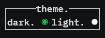

# My Personal Website

This is my very first attempt at making a personal webpage/portfolio using HTML, CSS and JavaScript. Below I have attempted, in-part (removing the tears, and blank stares at the screen), to describe my process, learning and hopefully the future development of this page as my skills and knowledge increase. 

View it here - https://keanbayneslow.github.io/

## Requirements - AcademyXi

This project is an opportunity to showcase what you've learned so far, so it is important that HTML, CSS, and JavaScript are incorporated into the project in some way. For example, you could use a mouseover event to change the appearance of an element when the user mouses over it. Or use a click event to toggle some content between being visible and hidden. There are a variety of ways to do this using the CSS and JavaScript you've learned so far, but don't forget you can always use Google if you get stuck. Google is an invaluable tool for developers! Try to use this project as an opportunity to stretch your coding skills!

The content, styling, and functionality of your site are up to you. Keep in mind that you may show this project to your peers and future instructors, so be considerate of content/subject matter and your potential audience.

## Process and Design Choices

### Minimalist Theme

Inspired by the work of Brittany Chang https://bchiang7.github.io/, I sought to make a minimalist portfolio page that to me, feels like you are part of the machine. 

My very first iteration, which consisted of a Navbar and Hero page, quickly became cluttered and untenable as I tried to cram more elements that I  wanted to try or found interesting into it. Starting again almost from scratch my design mentality focused on being clean, simple and easy to update with future information (see Future Developments). I quickly learned of course that having less on the page doesn't always mean less or easier code. 

In terms of color, I chose to keep it to a maximum of three which the main two being interchangeable through the light and dark theme with the highlight color working across both themes. 

| Color       | Hex Code    |
| ----------- | ----------- |
| Main Dark   | #111213     |
| Main Light  | #f5f5f5e5   |
| Highlight   | #00CE44     |


### User Greeting

To practice using JavaScript, I wanted to add some functionality for my personal website to greet the user once they input their name. I wanted this to be simple and in keeping with the minimalist theme.

```javascript
const greetings = [
    "array of different greetings to create a random response",
];

function greetUser() {
    const userName = prompt("What is your name?");
    if (userName) {
        const greetingElement = document.getElementById("greeting");
        const randomGreeting = greetings[Math.floor(Math.random() * greetings.length)];
        greetingElement.textContent = `${randomGreeting} ${userName}!`;

        greetingElement.classList.add("greeting-show");

        const button = document.querySelector("button");
        button.style.display = "none";
    }
};
```
- The greetUser() function is defined. This function will be executed when it is called.

- Inside the function, I used the prompt() method to display a pop-up box asking the user to enter their name. The user can type their name into the box, and the name they enter will be stored in the variable userName.

- I then check if the userName variable has a value, meaning the user actually typed something and didn't click "Cancel" in the prompt. If userName has a value, I proceed with the greeting.

- I added a specific element in the HTML document with the ID "greeting" using document.getElementById("greeting"). This element is where I wanted to display the greeting message.

- Next, I have an array called greetings that contains different greeting messages, like "Hello," "Welcome," "Kia Ora," and so on.

- Using Math.floor(Math.random() * greetings.length). I was able to select a greeting randomly which will be displayed. This gives a random index number within the range of the array length.

- With the random greeting and the user's name, the function create a personalised message, like "Hello [Your Name]!" using template literals (backticks`` and ${}).

- I then set this personalised message as the content of the greetingElement using greetingElement.textContent.

- To make the greeting look cool, I added a CSS class called "greeting-show" to the greetingElement. This class contains styling that adds a nice animation to the greeting.

- Lastly, the <button> element using document.querySelector("button"), is hidden by setting its display style to "none." This prevents the user from clicking the button again and repeating the greeting immediately.

### Light and Dark Theme

The theme switch/selector, I originally completed as a toggle design but once it was completed I didn't feel it worked with the site theme, instead I opted for a simple radio button selector because it felt more mechanical.



The theme selection was initially completed using only CSS and the functional :has() pseudo-class. I soon discovered that this might not be compatible with all browsers so I had to include a JS redundancy.

### Highlight Effect

I saw this effect in Brittany's webpage and became obsessed with making it for myself.

My initial attempt worked partially but resulted in turning the whole screen green instead of just my contact link.

Eventually I worked out how to make the effect for myself:


```html
<h3 class="intro__contact">Get in touch <span><a href="mailto:kean.bayneslow@gmail.com" target="_blank" class="highlight__link">kean.bayneslow@gmail.com</a> </span> </h3>
```


```css
.highlight__link {
    text-decoration: none;
    color: inherit;
    position: relative;
}

.highlight__link::after {
    content: '';
    height: 2px;
    background: #00CE44;
    position: absolute;
    left: 0;
    bottom: -1px;
    width: 100%;
    z-index: -2;
    transition: all 0.3s;
    transform-origin: 0% 100%;
}

.highlight__link:hover {
    transition: all 0.5s;
}

.highlight__link:hover::after {
    transform: scaleY(13);
}
```

## Lessons Learned

- Correct Rendering: HTML and CSS are parsed by the browser sequentially, from top to bottom. The order of elements and styles in the code affects how the browser renders the page. If the order is incorrect, it may lead to unexpected or incorrect rendering of elements, which can result in a broken layout or visual inconsistencies.

- CSS Specificity: The order of rules matters when determining which style should be applied to an element. When multiple CSS rules target the same element with overlapping selectors, the one defined last takes precedence. By maintaining order, I can ensure that the desired styles are applied consistently based on the specificity rules.

- Overriding Styles: Different parts of the codebase may define conflicting styles, even in relatively small projects like this. By carefully ordering CSS rules, it is easier to control which styles take precedence over others. This prevents unintentional style conflicts and helps maintain a consistent and cohesive visual design.

- Responsive Design: In responsive web design, the order of HTML elements and CSS rules can impact how the page behaves on different screen sizes and devices. By organising elements and styles logically, one can create a more predictable and flexible layout that adapts well to various devices.

- Readability and Maintainability: A well-organised code structure enhances code readability and makes it easier to maintain. When you or other developers or myself revisit the code in the future, a logical order will help them quickly understand the layout and styles, reducing the chances of introducing errors during maintenance.

- Accessibility: The order of HTML elements can affect how screen readers and other assistive technologies interpret the content. Maintaining a proper order ensures that users with disabilities can access and navigate the content effectively.

- Defining Height: In general don't define height, allow to grow with the content. Defining width is fine. 

## Future Developments

- At the time of updating I have not cracked the code on storing the selected theme in the browser's LocalStorage and remembering this selection across multiple visits. I would like to keep working on this. 

- Including further JavaScript to make the Project Section render Dynamically which I hope will make it much easier to update with future project additions.

- Media Query Layout, I would like to keep working on this with a mobile first design for future iterations as I did struggle making the page fully responsive. 
